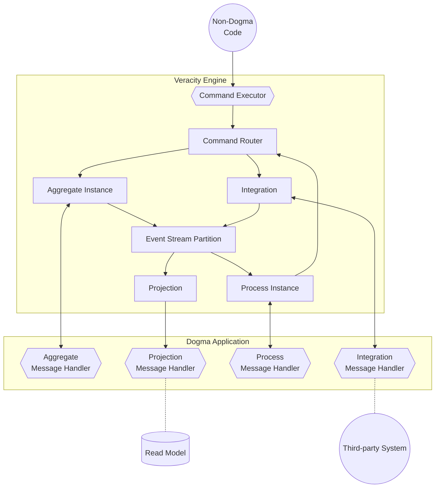

```mermaid
flowchart TD
    NonDogma(("Non-Dogma\nCode"))

    subgraph App["Dogma Application"]
        AggregateHandler{{"Aggregate\nMessage Handler"}}
        IntegrationHandler{{"Integration\nMessage Handler"}}
        ProcessHandler{{"Process\nMessage Handler"}}
        ProjectionHandler{{"Projection\nMessage Handler"}}
    end

    subgraph Engine["Veracity Engine"]
        Executor{{"Command Executor"}}

        Router["Command Router"]

        AggregateInstance["Aggregate Instance"]
        Integration["Integration"]
        ProcessInstance["Process Instance"]
        Projection["Projection"]

        EventStreamPartition["Event Stream Partition"]
    end

    NonDogma --> Executor

    Executor --> Router

    Router --> AggregateInstance
    Router --> Integration

    AggregateInstance <--> AggregateHandler
    AggregateInstance --> EventStreamPartition

    Integration <--> IntegrationHandler
    IntegrationHandler -.- ThirdParty(("Third-party System"))
    Integration --> EventStreamPartition

    EventStreamPartition --> ProcessInstance
    ProcessInstance <--> ProcessHandler
    ProcessInstance --> Router

    EventStreamPartition --> Projection
    Projection --> ProjectionHandler
    ProjectionHandler -.- ReadModel[("Read Model")]

    click AggregateHandler "https://pkg.go.dev/github.com/dogmatiq/dogma#AggregateMessageHandler"
    click ProcessHandler "https://pkg.go.dev/github.com/dogmatiq/dogma#ProcessMessageHandler"
    click IntegrationHandler "https://pkg.go.dev/github.com/dogmatiq/dogma#IntegrationMessageHandler"
    click ProjectionHandler "https://pkg.go.dev/github.com/dogmatiq/dogma#ProjectionMessageHandler"
```
