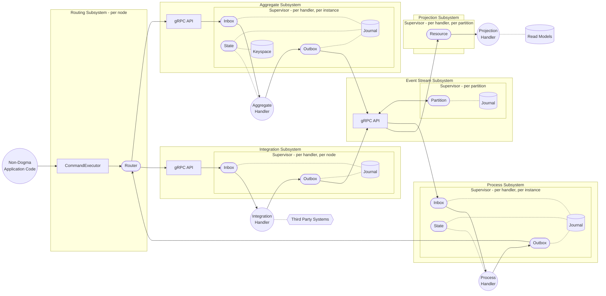

```mermaid
flowchart LR
    NonDogma((Non-Dogma\nApplication Code))

    AggregateMessageHandler((Aggregate\nHandler))
    ProcessMessageHandler((Process\nHandler))
    IntegrationMessageHandler((Integration\nHandler))
    ProjectionMessageHandler((Projection\nHandler))

    ProjectionDatabase[(Read Models)]
    ThirdPartySystems{{Third Party Systems}}

    ProjectionMessageHandler -.- ProjectionDatabase
    IntegrationMessageHandler -.- ThirdPartySystems

    NonDogma --> CommandExecutor

    subgraph Routing[Routing Subsystem - per node]
        CommandExecutor
        Router([Router])

        CommandExecutor --> Router
    end

    Router --> AggregateAPI
    Router --> IntegrationAPI

    subgraph EventStreams[Event Stream Subsystem]
        EventStreamAPI[gRPC API]

        subgraph EventStreamSupervisor[Supervisor - per partition]
            EventStreamPartition([Partition])
            EventStreamJournal[(Journal)]
            EventStreamPartition -.- EventStreamJournal
        end

        EventStreamAPI <--> EventStreamPartition
    end

    subgraph Aggregates[Aggregate Subsystem]
        AggregateAPI[gRPC API]

        subgraph AggregateSupervisor[Supervisor - per handler, per instance]
            AggregateInbox([Inbox])
            AggregateOutbox([Outbox])
            AggregateState([State])
            AggregateJournal[(Journal)]
            AggregateKV[(Keyspace)]

            AggregateInbox -.- AggregateJournal
            AggregateOutbox -.- AggregateJournal
            AggregateState -.- AggregateJournal
            AggregateState -.- AggregateKV
        end

        AggregateAPI --> AggregateInbox
    end

    AggregateInbox --> AggregateMessageHandler
    AggregateMessageHandler --> AggregateOutbox
    AggregateState -.- AggregateMessageHandler
    AggregateOutbox --> EventStreamAPI

    subgraph Processes[Process Subsystem]
        subgraph ProcessSupervisor[Supervisor - per handler, per instance]
            ProcessInbox([Inbox])
            ProcessOutbox([Outbox])
            ProcessState([State])
            ProcessJournal[(Journal)]

            ProcessInbox -.- ProcessJournal
            ProcessOutbox -.- ProcessJournal
            ProcessState -.- ProcessJournal
        end
    end

    EventStreamAPI --> ProcessInbox
    ProcessInbox --> ProcessMessageHandler
    ProcessMessageHandler --> ProcessOutbox
    ProcessState -.- ProcessMessageHandler
    ProcessOutbox --> Router

    subgraph Integrations[Integration Subsystem]
        IntegrationAPI[gRPC API]

        subgraph IntegrationSupervisor[Supervisor - per handler, per node]
            IntegrationInbox([Inbox])
            IntegrationOutbox([Outbox])
            IntegrationJournal[(Journal)]

            IntegrationInbox -.- IntegrationJournal
            IntegrationOutbox -.- IntegrationJournal
        end

        IntegrationAPI --> IntegrationInbox
    end

    IntegrationInbox --> IntegrationMessageHandler
    IntegrationMessageHandler --> IntegrationOutbox
    IntegrationOutbox --> EventStreamAPI

    subgraph Projections[Projection Subsystem]
        subgraph ProjectionSupervisor[Supervisor - per handler, per partition]
            ProjectionResource([Resource])
        end
    end

    EventStreamAPI --> ProjectionResource
    ProjectionResource --> ProjectionMessageHandler
```
