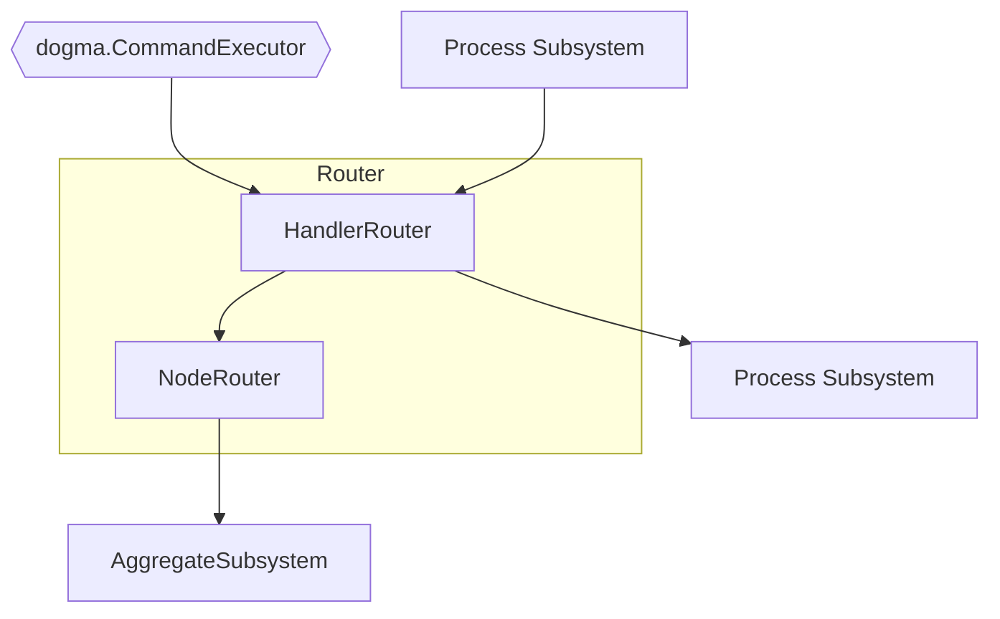

## Command Router

```mermaid
flowchart TD
    subgraph Router
        HandlerRouter
        NodeRouter
    end

    CommandExecutor{{"dogma.CommandExecutor"}}
    ProcessSubsystem["Process Subsystem"]
    IntegrationSubsystem["Process Subsystem"]

    CommandExecutor --> HandlerRouter
    ProcessSubsystem --> HandlerRouter

    AggregateSubsystem
    IntegrationSubsystem

    HandlerRouter --> NodeRouter
    HandlerRouter --> IntegrationSubsystem
    NodeRouter --> AggregateSubsystem
```
