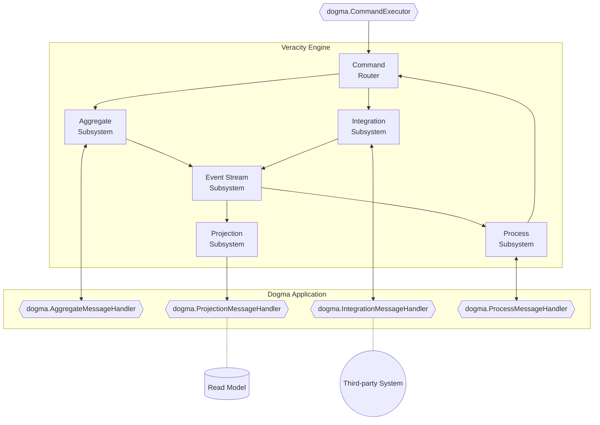

# Architecture

```mermaid
flowchart TD
    CommandExecutor{{"dogma.CommandExecutor"}}

    subgraph App["Dogma Application"]
        AggregateMessageHandler{{"dogma.AggregateMessageHandler"}}
        ProjectionMessageHandler{{"dogma.ProjectionMessageHandler"}}
        IntegrationMessageHandler{{"dogma.IntegrationMessageHandler"}}
        ProcessMessageHandler{{"dogma.ProcessMessageHandler"}}
    end

    subgraph Engine["Veracity Engine"]
        CommandRouter["Command\nRouter"]

        AggregateSubsystem["Aggregate\nSubsystem"]
        IntegrationSubsystem["Integration\nSubsystem"]
        ProcessSubsystem["Process\nSubsystem"]
        ProjectionSubsystem["Projection\nSubsystem"]

        EventStreamSubsystem["Event Stream\nSubsystem"]
    end

    CommandExecutor --> CommandRouter

    CommandRouter --> AggregateSubsystem
    CommandRouter --> IntegrationSubsystem

    AggregateSubsystem <--> AggregateMessageHandler
    AggregateSubsystem --> EventStreamSubsystem

    IntegrationSubsystem <--> IntegrationMessageHandler
    IntegrationMessageHandler -.- ThirdParty(("Third-party System"))
    IntegrationSubsystem --> EventStreamSubsystem

    EventStreamSubsystem --> ProcessSubsystem
    ProcessSubsystem <--> ProcessMessageHandler
    ProcessSubsystem --> CommandRouter

    EventStreamSubsystem --> ProjectionSubsystem
    ProjectionSubsystem --> ProjectionMessageHandler
    ProjectionMessageHandler -.- ReadModel[("Read Model")]

    click CommandExecutor "https://pkg.go.dev/github.com/dogmatiq/dogma#CommandExecutor"
    click AggregateMessageHandler "https://pkg.go.dev/github.com/dogmatiq/dogma#AggregateMessageHandler"
    click ProcessMessageHandler "https://pkg.go.dev/github.com/dogmatiq/dogma#ProcessMessageHandler"
    click IntegrationMessageHandler "https://pkg.go.dev/github.com/dogmatiq/dogma#IntegrationMessageHandler"
    click ProjectionMessageHandler "https://pkg.go.dev/github.com/dogmatiq/dogma#ProjectionMessageHandler"

    click CommandRouter "command-router.md"
```
