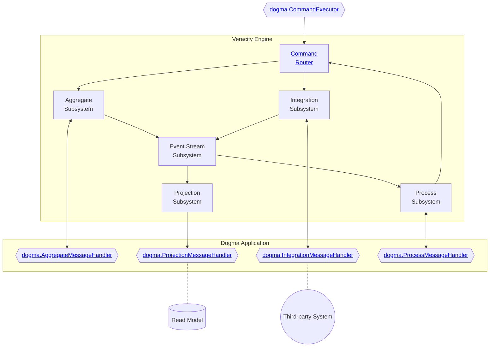

# Architecture

```mermaid
flowchart TD
    CommandExecutor{{"<a href='https://pkg.go.dev/github.com/dogmatiq/dogma#CommandExecutor'>dogma.CommandExecutor</a>"}}

    subgraph App["Dogma Application"]
        AggregateMessageHandler{{"<a href='https://pkg.go.dev/github.com/dogmatiq/dogma#AggregateMessageHandler'>dogma.AggregateMessageHandler</a>"}}
        ProjectionMessageHandler{{"<a href='https://pkg.go.dev/github.com/dogmatiq/dogma#ProjectionMessageHandler'>dogma.ProjectionMessageHandler</a>"}}
        IntegrationMessageHandler{{"<a href='https://pkg.go.dev/github.com/dogmatiq/dogma#IntegrationMessageHandler'>dogma.IntegrationMessageHandler</a>"}}
        ProcessMessageHandler{{"<a href='https://pkg.go.dev/github.com/dogmatiq/dogma#ProcessMessageHandler'>dogma.ProcessMessageHandler</a>"}}
    end

    subgraph Engine["Veracity Engine"]
        CommandRouter["<a href='./command-router.md'>Command\nRouter</a>"]

        AggregateSubsystem["Aggregate\nSubsystem"]
        IntegrationSubsystem["Integration\nSubsystem"]
        ProcessSubsystem["Process\nSubsystem"]
        ProjectionSubsystem["Projection\nSubsystem"]

        EventStreamSubsystem["Event Stream\nSubsystem"]
    end

    CommandExecutor --> CommandRouter

    CommandRouter --> AggregateSubsystem
    CommandRouter --> IntegrationSubsystem

    AggregateSubsystem <--> AggregateMessageHandler
    AggregateSubsystem --> EventStreamSubsystem

    IntegrationSubsystem <--> IntegrationMessageHandler
    IntegrationMessageHandler -.- ThirdParty(("Third-party System"))
    IntegrationSubsystem --> EventStreamSubsystem

    EventStreamSubsystem --> ProcessSubsystem
    ProcessSubsystem <--> ProcessMessageHandler
    ProcessSubsystem --> CommandRouter

    EventStreamSubsystem --> ProjectionSubsystem
    ProjectionSubsystem --> ProjectionMessageHandler
    ProjectionMessageHandler -.- ReadModel[("Read Model")]
```
