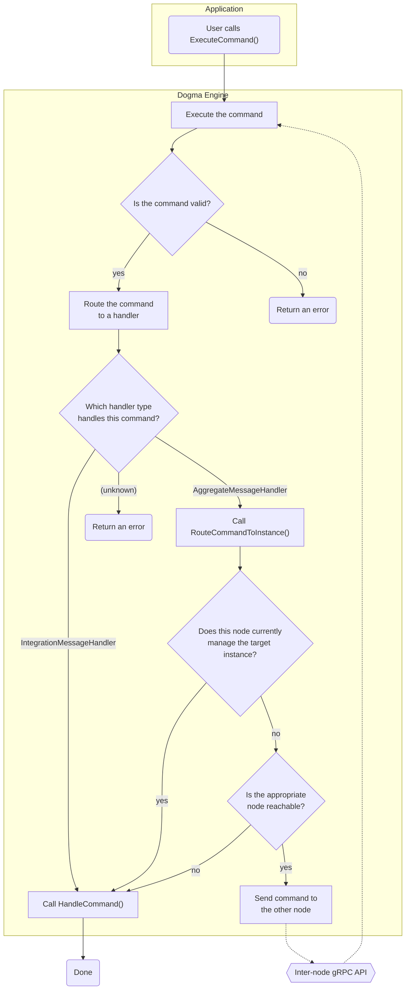

```mermaid
flowchart TD
    subgraph Application
        Begin("User calls ExecuteCommand()")
    end

    subgraph Dogma Engine
        Begin --> Execute

        Execute[Execute the command]
        Valid?{Is the command valid?}
        RouteToHandler[Route the command\nto a handler]
        HandlerType?{Which handler type\nhandles this command?}
        RouteToInstance["Call RouteCommandToInstance()"]
        ThisNode?{"Does this node currently\nmanage the target instance?"}
        Handle["Call HandleCommand()"]
        Reachable?{"Is the appropriate\nnode reachable?"}
        Send[Send command to\nthe other node]

        Execute --> Valid?

        Valid? -- yes --> RouteToHandler
        Valid? -- no --> NotValid(Return an error)

        RouteToHandler --> HandlerType?

        HandlerType? -- AggregateMessageHandler --> RouteToInstance
        HandlerType? -- IntegrationMessageHandler --> Handle
        HandlerType? -- "(unknown)" --> Unknown(Return an error)

        RouteToInstance --> ThisNode?

        ThisNode? -- yes --> Handle
        ThisNode? -- no --> Reachable?

        Reachable? -- yes --> Send
        Reachable? -- no --> Handle
    end

    API{{Inter-node gRPC API}}
    Send -.-> API
    API -.-> Execute

    Done(Done)
    Handle --> Done

```
