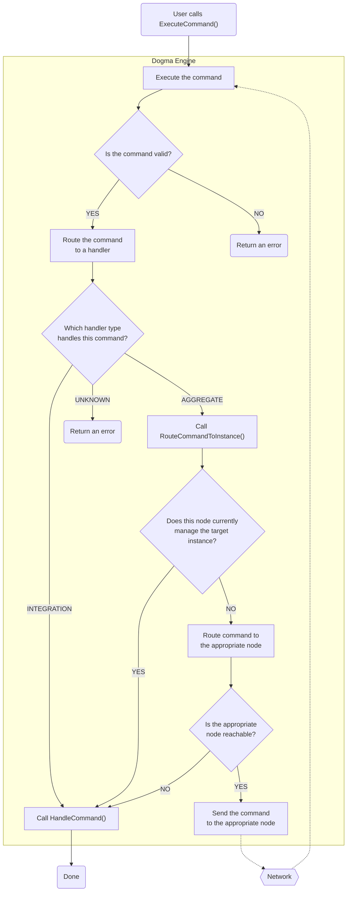

```mermaid
flowchart TD
    Begin("User calls ExecuteCommand()")
    Network{{Network}}
    Done(Done)

    Begin --> Execute

    subgraph Dogma Engine
        Execute[Execute the command]
        Valid?{Is the command valid?}
        RouteToHandler[Route the command\nto a handler]
        HandlerType?{Which handler type\nhandles this command?}
        RouteToInstance["Call RouteCommandToInstance()"]
        ThisNode?{"Does this node currently\nmanage the target instance?"}
        RouteToNode[Route command to\nthe appropriate node]
        Reachable?{"Is the appropriate\nnode reachable?"}
        Send[Send the command\nto the appropriate node]
        Handle["Call HandleCommand()"]

        Execute --> Valid?

        Valid? -- YES --> RouteToHandler
        Valid? -- NO --> NotValid(Return an error)

        RouteToHandler --> HandlerType?

        HandlerType? -- AGGREGATE --> RouteToInstance
        HandlerType? -- INTEGRATION --> Handle
        HandlerType? -- UNKNOWN --> Unknown(Return an error)

        RouteToInstance --> ThisNode?

        ThisNode? -- YES --> Handle
        ThisNode? -- NO --> RouteToNode

        RouteToNode --> Reachable?
        Reachable? -- NO --> Handle
        Reachable? -- YES --> Send
    end

    Send -.-> Network
    Network -.-> Execute

    Handle --> Done
```
