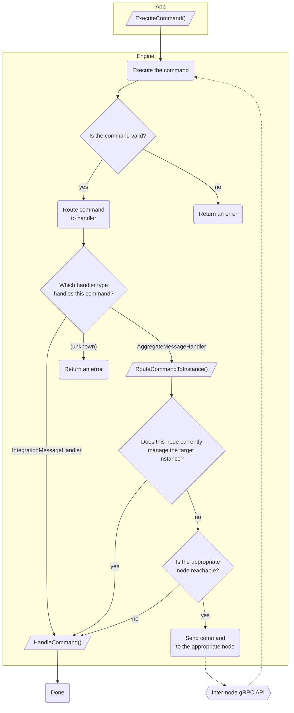

```mermaid
flowchart TD
    subgraph App
        ExecuteCommand[/"ExecuteCommand()"/]
    end

    subgraph Engine
        Begin(Execute the command)
        ExecuteCommand --> Begin
        Valid?{Is the command valid?}
        RouteToHandler(Route command\nto handler)
        HandlerType?{Which handler type\nhandles this command?}
        RouteToInstance[/"RouteCommandToInstance()"/]
        ThisNode?{"Does this node currently\nmanage the target instance?"}
        Handle[/"HandleCommand()"/]
        Reachable?{"Is the appropriate\nnode reachable?"}
        Send(Send command\nto the appropriate node)

        Begin --> Valid?

        Valid? -- yes --> RouteToHandler
        Valid? -- no --> NotValid(Return an error)

        RouteToHandler --> HandlerType?

        HandlerType? -- AggregateMessageHandler --> RouteToInstance
        HandlerType? -- IntegrationMessageHandler --> Handle
        HandlerType? -- "(unknown)" --> Unknown(Return an error)

        RouteToInstance --> ThisNode?

        ThisNode? -- yes --> Handle
        ThisNode? -- no --> Reachable?

        Reachable? -- yes --> Send
        Reachable? -- no --> Handle

    end

    API{{Inter-node gRPC API}}
    Send -.-> API
    API -.-> Begin

    End(Done)
    Handle --> End
```
